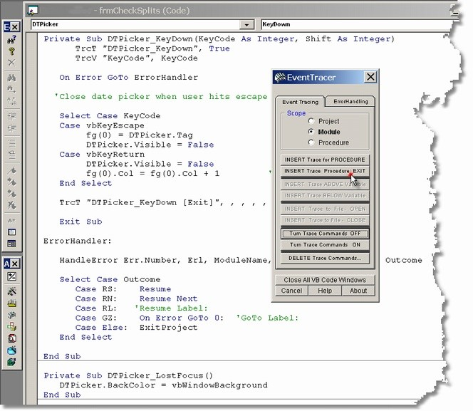



## EventTracer v223 Add\-In

### Description

EventTracer is a VB6 Add-In which is a versatile tool for eliminating those nearly impossible to fix bugs.

It has the ability to Trace/log viturally any amount of code to a file (instead of just to the Immediate Window). Adding Trace commands for procedures and/or variables is almost entirely automated and all Tracing can be Turned Off or On with the click of a button, making it a very fast and efficient debugging tool.

Version 2.2 includes a number of enhancements and bug fixes which make it faster and easier to use.

EventTracer also includes a very capable Error Handling module which can process custom error exceptions and Add, or Remove, procedure line numbers. It also creates and maintains multiple error logs.
 
### More Info
 

             |
---                |---
**Submitted On**   |2002-06-01 11:30:06
**By**             |[Clayton Parman](https://github.com/Planet-Source-Code/PSCIndex/blob/master/ByAuthor/clayton-parman.md)
**Level**          |Intermediate
**User Rating**    |5.0 (20 globes from 4 users)
**Compatibility**  |VB 6\.0
**Category**       |[Debugging and Error Handling](https://github.com/Planet-Source-Code/PSCIndex/blob/master/ByCategory/debugging-and-error-handling__1-26.md)
**World**          |[Visual Basic](https://github.com/Planet-Source-Code/PSCIndex/blob/master/ByWorld/visual-basic.md)
**Archive File**   |[EventTrace89098612002\.zip](https://github.com/Planet-Source-Code/clayton-parman-eventtracer-v223-add-in__1-33472/archive/master.zip)

